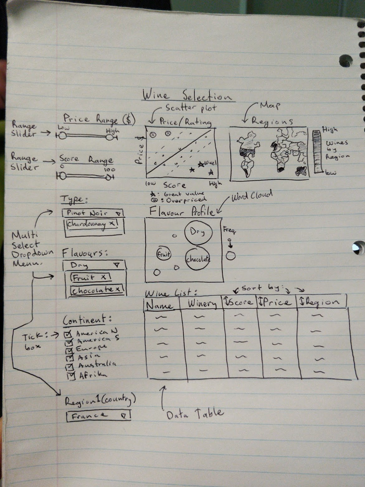

## Overview

The paradox of choice is a psycological paradigm in which giving consumers more choice increases the difficulty of making a decision. This holds true with the wine industry as there is a wine for literally every occasion. The goal of this visualization tool is to help consumers narrow their options to help them make the best decisions, tailored to their tastes.

## Description of the Data

I will be analyzing the Wine Magazine dataset that includes 150,000 different wines from around the globe. Parameters for each entry include the country of origin (country), a brief description of the wine that describes that taste (description), the winery designation of the series of wine (designation), a rating out of 100 (points), a price in USD per bottle (price), province in which the wine was made (province), sub-regional area of each province (region1 and region2), the twitter handle for the individual who rating the wine (taster_twitter_handle), the name of the individual who reviewed the wine (taster_name), name of the wine (title), the type of grape used to make the wine (variety), and the winery that produced the wine (winery). The data will require some wrangling as there are missing entries for various parameters. To help filter the data further, I will extract key words from the desciption parameter to make the flavour (taste) parameter. Rows that are missing vital pieces of information (price, rating, title, winery), I will completely remove from the analysis.

## Usage scenario & tasks

Buying the right wine for every occasion is a difficult task, even at the best of times. To ease the decision making process for consumers, providing them with access to key purchasing criterion is essential. Consumers want to be able to compare price to ratings in order to determine if they are getting good value for their money. The ability to compare a variety of wines and see their relative value is important. Consumers are also naturally 'picky' and opinionated, therefore they need a way to tailor their wine selection to match their personal taste. Consumers will want to filter their wine selection based off of key taste descriptors, instead of just by variety of wine. Consumers are also interested in where their wine is made for a variety of reasons, which may include ethics, local availablility, or value. The Wine Selection visualization tool will be able to address all of a consumers demands by showing them the information they are looking for, tailored to their demands. 

## Description of app & initial sketch

The app contains a landing page that has three plots and and one chart. The plots incude a scatter plot, and map, and a word cloud. The scatter plot contains information comparing price and score, and includes a trend line. Points on the scatter plot will be colour coordinated, and points that are below the trend line, indicating good value, will be denoted as such. The map shows the frequency distribution of the filtered wine list. This gives a visual representation to the consumer of where their favourite wines are from. The word cloud plot helps visualize the flavour profile of the filtered wine list. This indicates common flavours that are typical in the description of each wine. Finally, the top five lines of the filtered wine list will be included so consumers know the exact variety of wine to purchase during their next visit to the liquor store.

