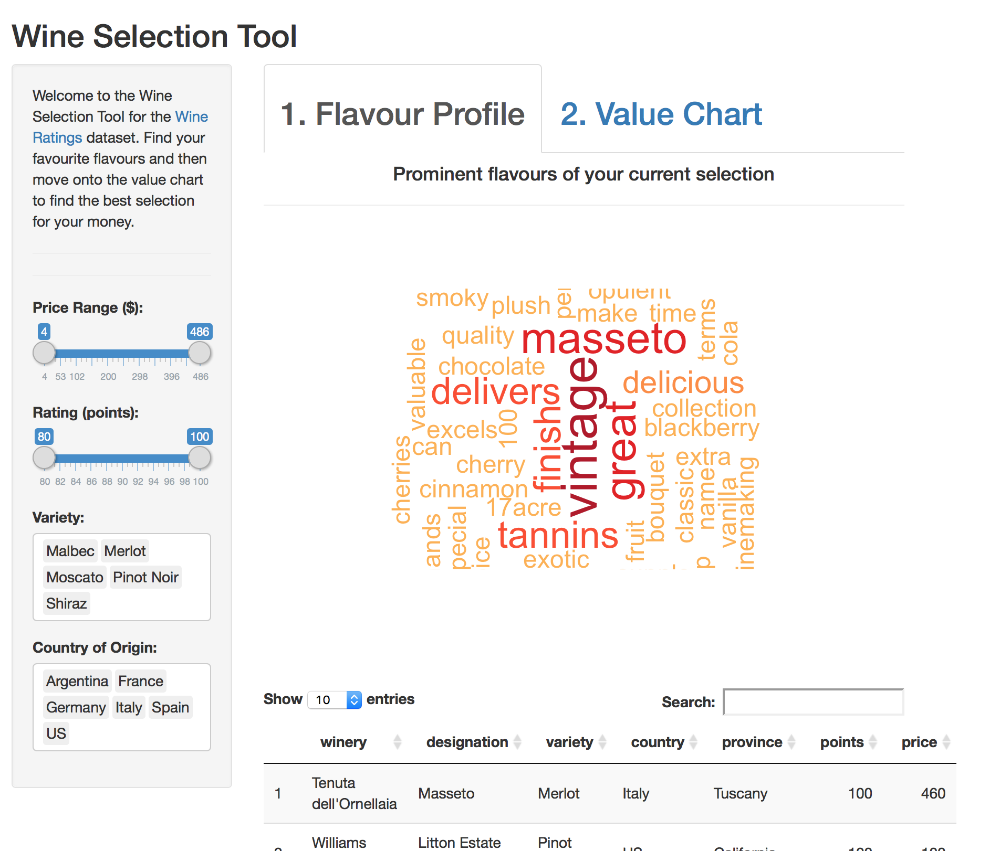
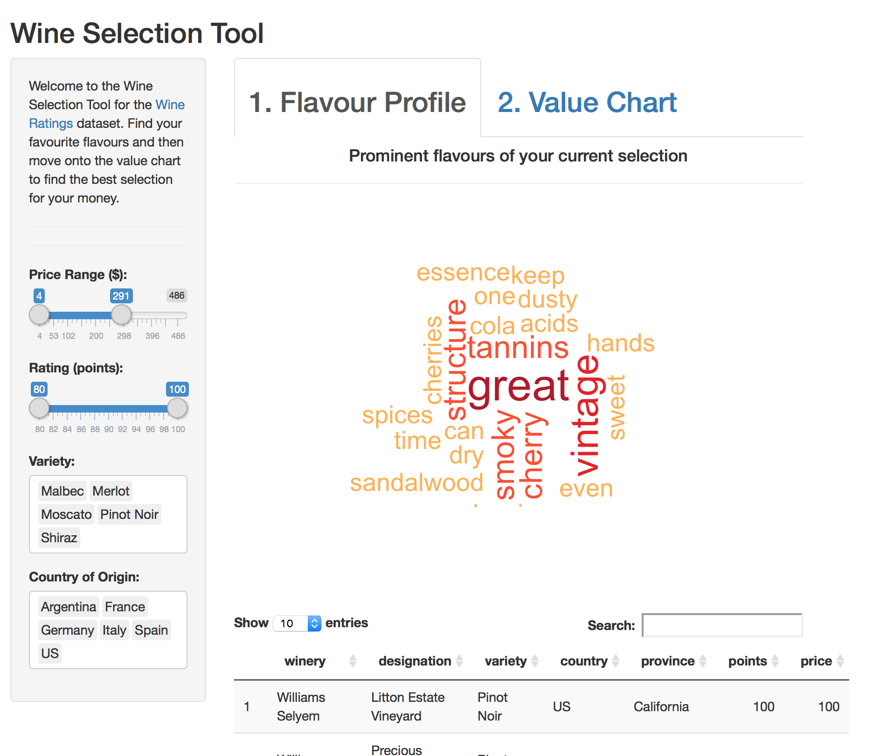
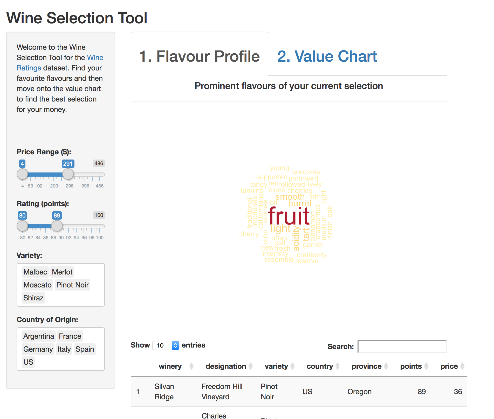
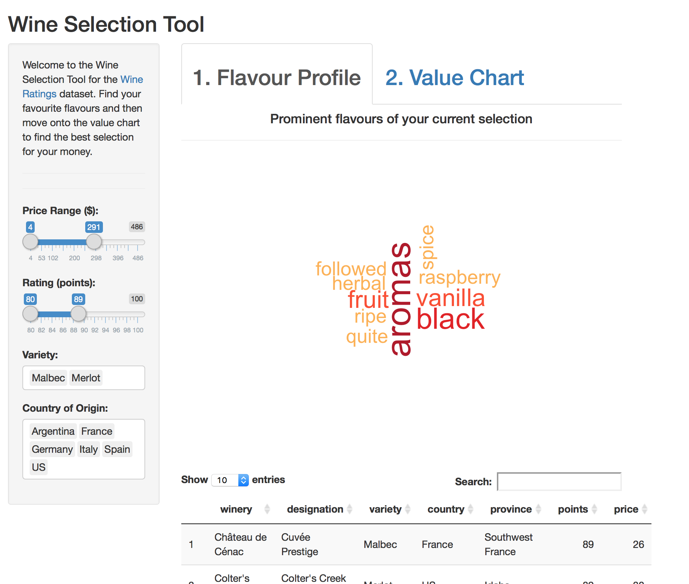
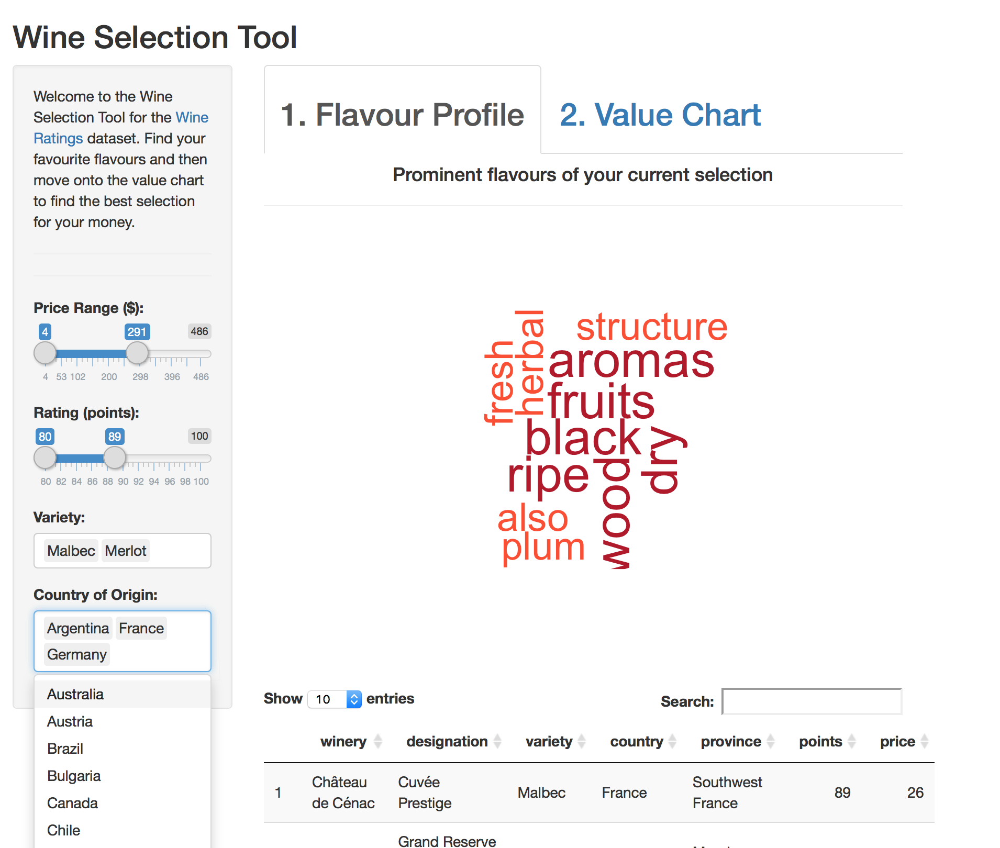
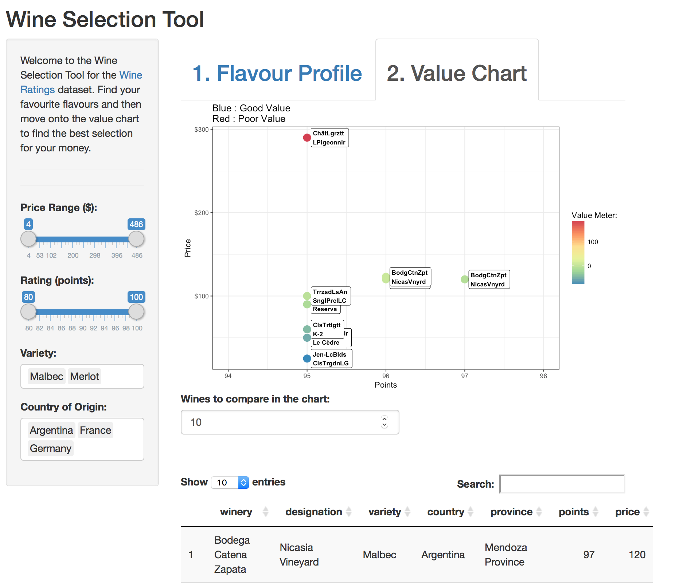
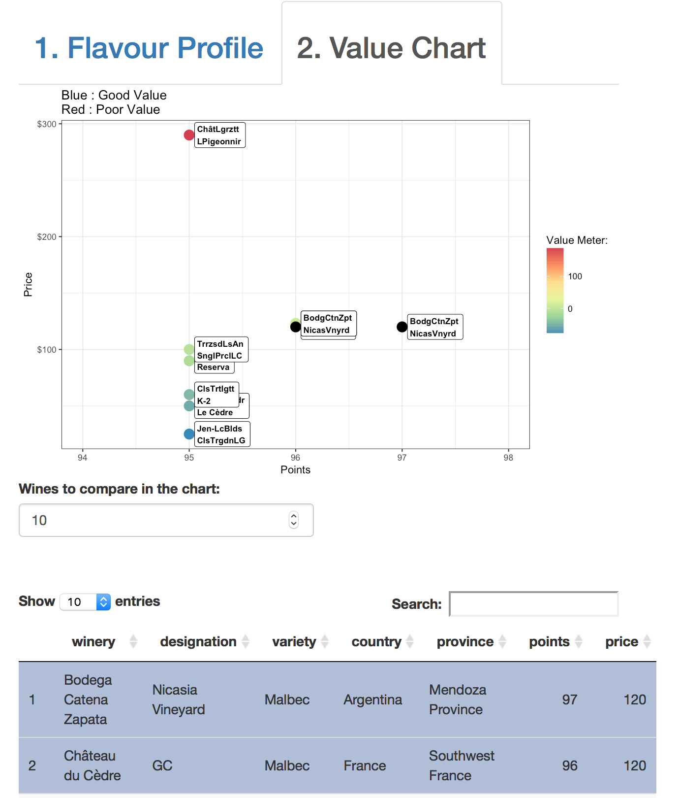
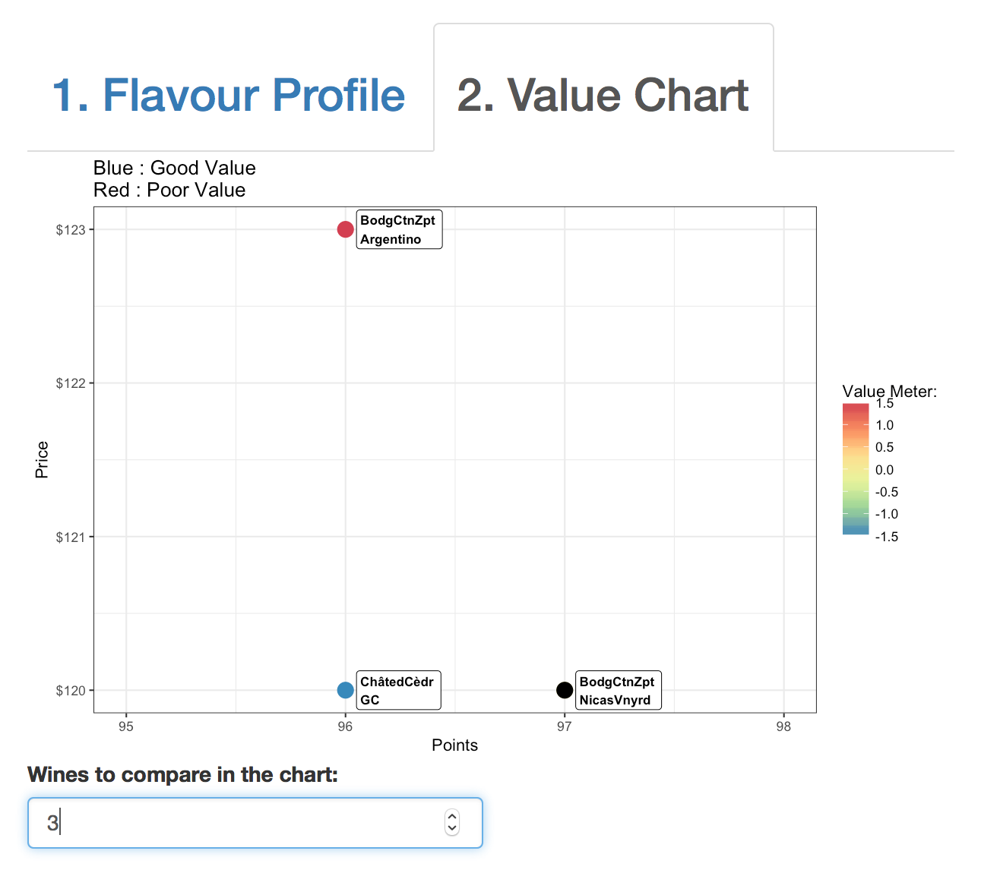
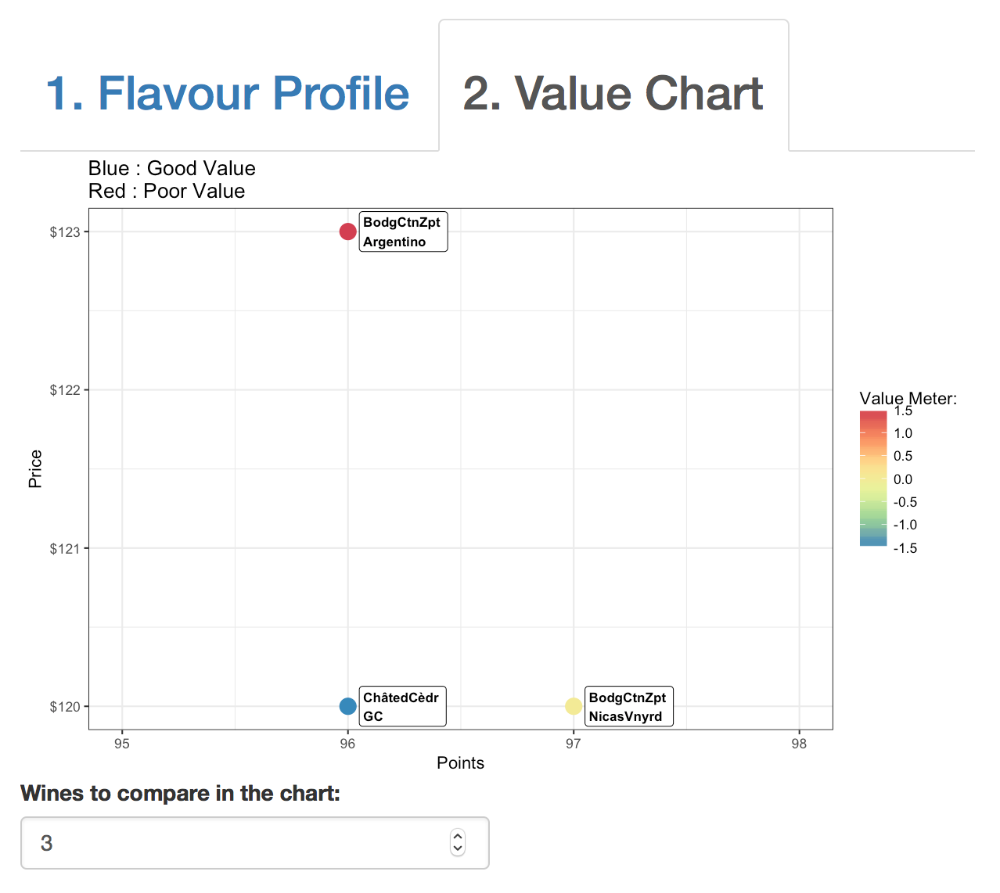

## Exercise 2: Reflection (14%)

### Topic: reflect on the feedback you received

rubric={reasoning:5}

> The main issue that both of my reviewers faced was with regard to the stability of my app. While the app was genrally well received and easy to use, the latency of the refresh rate on my inputs made it difficult to interact with the plots effectively. If mutiple inputs are changed before the app has finished refreshing, this will cause my app to crash. Generally I found that both of my reviewers used my app in its intended way, although it wasn't clear that the plots needed to refresh before a new selection could be made, resulting in frustration and non-working plots.  
> 
> To mitigate the frustration caused by the app only allowing a single input at a time for each rendering, I will remove the scaling selection tools based off of previous inputs. I had this feature in place to stop the user from going out of bounds within the dataset, however I have found that it is causing more issues than it is fixing.
> 
> I think that I will need to figure out a way to have the app refresh more quickly, or find a way to keep the inputs from becoming buggy during the multi-selection process.  
> 
> Another comment that I found useful was the interpreability of my value chart. The colour scheme of my chart made it difficult for my reviewers to understand exactly what was going on. I think that I will remove all unnecessary information from the plot, just keeping the coloured points on the graph, without any of the regression or residual lines. This will keep the users focus on the individual points' location within in the scatter plot, and highlight the importance of the colour (value) of each point.

### Topic: reflect on how your project has changed since your proposal

rubric={reasoning:5}

> The core philiosophy of my app has not changed since the proposal, however the general layout and functionality has changed. The goal of my app was, and remains to be a selection tool that could help a consumer in a liquor store make the best possible choice given their distinct tastes and budget. In my proposal, I had envisioned having 3 plots and a data table to convey all of what I considered to be 'useful' information to the consumer. These plots included a flavour profile, a value chart, and a world map, all of which were technically possible and reasonable. In my proposal I had shown all of these plots being on the same page, providing all of the necessary information in one screen. In practice this caused overplotting, and made the screen look too cluttered with information, detracting from the significance of each individual plot. In addition, I found that the world map did not provide enough useful information to the consumer to warrant being included in my app, so I decided to remove it.
> 
> To encourage the user to first make the flavour choice, and then move on to select the wine by price, I decided to keep the two plots on separate pages. The value chart and the flavour profile, while technically challenging to produce, I feel give the consumer the most important and concise information required to make a purchase.  
> 
> For the final revision of my app, I want to employ more interactivity between my value chart and my data table, however I am now more weary of its potential impact on latency issues due to rendering times. For my final submission I will be focusing on usability and stability of the app before adding any additional features.

### Topic: final thoughts

rubric={reasoning:4}

> If I were to remake the app again, I would make my main focus on usability before content. I am under the impression that even the most interesting site in the world could be a pain to use if not implemented properly. I figure if the app is easy to use and is intuitive, it will encourage people to use it more.
> 
> I found that the greatest challenge with this project is getting everything to work correctly and in harmony. Sometimes when I decided to add a new feature, I found that it would cause the things that had previously been working correctly to break or to act differently. This grew increasingly challenging as I added more features, and was working with multiple variables that are sensitive to various inputs.

## Exercise 3: Improved Shiny App (71%)

> I made the follwing improvements to my app following the peer review:  
> 
> 1. Improved stability:   
> Inputs are no longer scalable, however they do not cause plots to go out of bounds causing crashes. Scaling the inputs with each change was found to be causing the latency issues, decreasing usability. The new input interactivity allows for multiple selection/deselection at once, addressing Ivan's and Alex's usability issue.  
> 
> 2. Improved plot graphics  
> I have added interactivity between the data table and the value chart as per Sam's suggestion in my Milestone 2 Review. Clicking on rows of the data table will highlight items on the chart, adding interactivity between these two plots.
>   
> 3. Improved layout  
> I have increased the size of tabs and added numbers to tabs to encourage interaction between tabs. I have added a title to the flavour profile to suggest that it is interactive with the selection inputs on the side of the page.

#### Screenshot 1

The main page with default settings.

#### Screenshot 2

The main page with modified price range setting.

#### Screenshot 3

The main page with modified point range setting.

#### Screenshot 4

The main page with modified wine variety settings.

#### Screenshot 5

The main page with modified country settings.

#### Screenshot 6

The value chart with interactivity with the value plot. Selected rows on the table will highlight values on the chart.

#### Screenshot 7

The rendered datatable with varying size.

#### Screenshot 8

The reduced the number of points on the value chart using the numeric selector.

#### Screenshot 9

Deselected all points.
