# Milestone 2: App Write Up
#### Ted Haley

## Design Rationale
### Data Wrangling
The wine magazine dataset includes 150,000 different wines from around the globe. Each entry includes the country of origin (country), a brief description of the wine that describes that taste (description), the winery designation of the series of wine (designation), a rating out of 100 (points), a price in USD per bottle (price), province in which the wine was made (province), sub-regional area of each province (region1 and region2), the twitter handle for the individual who rating the wine (taster_twitter_handle), the name of the individual who reviewed the wine (taster_name), the type of grape used to make the wine (variety), and the winery that produced the wine (winery). To make the dataset more usable and responsive, I removed rows that included any missing data. Additionally, the tool I am making is intended to be used by consumers, and as such, I wanted to only include wines that a realistic consumer would purchased, so I removed wines costing more than $500 per bottle and I limited to the variety of wines to non-blended, commercially available varieties. I then discarded parameters that I did not think would be useful for the analysis, which included the removal of subregions, reviewer names, and twitter handles.

This left me with a complete dataset that includes countries (string, location), wine description (string), designation (string), rating points (integer), price in USD (integer, USD), province (string, location), variety (string), and winery (string). 

### Plot Choices 

The challenge with this dataset is trying to determine what information is relevant to the consumer and when to show it. The majority of the data are string values, making quantitative analysis challenging, but has also allowed me to abstract new uses for the data. 

The typical consumer is  interested in getting the best deal on whatever they buy, so allowing them to see a comparison between price and goodness (rating) of many products is important. I believe this is a good first step, however not everyone has the same tastes in wine, therefore having a method to see what something tastes like is essential. Finally, if I were in a liquor store and wanted to buy one of these wines, I would need to know exactly what the wine is called, what variety it is, where it's from, etc.

I decided on three outputs that I believe would best suite the needs of the consumer listed above. These plots include a word cloud that would describe the flavour profile of the selected wines, a value chart that would plot the top rated wines from a selected price range and would identify wines that are a good/bad value, and a rendered data table that would show the wines identified as good/bad value in the value chart.  

### Layout and Interaction

I decided to follow a familiar layout with the manipulation tools on the left hand side, and the mainplot area displaying an interactive plot that can be switched between tabs, along with a static data table below. The purpose of the tabs for the interactive plots is to not overload the user with too much information on one screen. Keeping the rendered data table static at the bottom of the page provides reference to the user between pages and allows them to know which wines are being analyzed.

The side panel includes 5 inputs. They include 2 range sliders (one for price, one for points), 2 mutli-select dropdown menus (one for variety of wine, one for country), and 1 numeric input (for the number of wines to compare in the value chart).

These inputs allow the user to modify the price to their desired price range, as well as change the rating scale to fine tune the desired rating. These inputs modify all of the outputs, including the word cloud, the value chart, and the rendered data table. The wine variety selector is a dropdown selector with the ability to have multiple wine varieties selected at once. This is important as price, rating (points), and flavours all change fairly dramatically depending on the variety of wine. By selecting mutiple wine varieties, one can see how the flavour profile changes and what variety of wines offer the best value. The country selector is again a muti-select dropdown menu that allows the user to select mutiple countries. This selector is important because quality of wine varies greatly by region and country. Allowing the user to specify where their wine is from could affect the flavour profile of the wine, as well as its relative value. Finally, the numeric input allows the user to select how many wines they wish to compare on the value chart. While writting this report, I realized that this input should only be found on the value chart tab, as that is the only plot it relates to. This input is important because it gives control to the user to see if there are more wines within their desired criteria that may also be of good value.

The flavour profile word cloud is a plot that reads the description of the top 50 wines in the users desired criteria, and outputs the frequency of the most common descriptor words. I decided to have the flavour profile be the first plot on the main tab because price and score are irrelevant if the flavours of the wine do not match the users tastes. The flavour profile word cloud is sensitive to the price, points, variety, and country inputs. Each one of the input parameters has some effect on the flavour profile. 

Once the user has found combination of flavours that match their taste, they may continue to the second tab where the value chart is found. The value chart is a scatter plot that plots the price and points rating of the top 'x' wines, where 'x' is a user defined parameter. A linear regression line is fit to the points, and the residuals are measured to each point. The residuals, depending on if they are positive or negative, are colour coordianted to give a sense of value to each of the plotted points. This plot makes it easy for the user to identify a wine with good value (the best score with the minimum price), and look for it in the rendered data table below to seek more information. Every point on the scatter plot is has the name of the winery and the designation (title) of each wine. 

The rendered data table remains static between tabs, however it is dynamic to all of the inputs noted above. The data table acts as a reference to the user between pages. By default the table organizes the wines by highest rated for the given price range (as it correlates to the value chart), however these are all modifyable by the user. The user can specify if they would like the data sorted by winery, designation, variety, country, points, or price. In addition, the entire dataset is searchable so the user can find any specific wine they may be looking for.

## Changes from the Proposal
### Reduction of Scope
The app layout from milestone 1 was admittantly a little ambitious. There had been a couple of features that I thought would look 'cool', but realistically didn't add very much substance. As a result, I decided to remove the world map from the app as it made it run more slowly, and didn't contribute much meaning to the consumer. The map was intended to show the quantity of the selected wines are from each country, however in reality this did not work very well as there are some countries that produce far more wine than others. This resulted in the US and various European countries consistantly showing the same values. Removing the map from the app also mean't that I would remove the inputs associated with it from the toolbar. I removed the continent, region, and flavour selection inputs from the toolbar as a result.

#### Screenshot 1
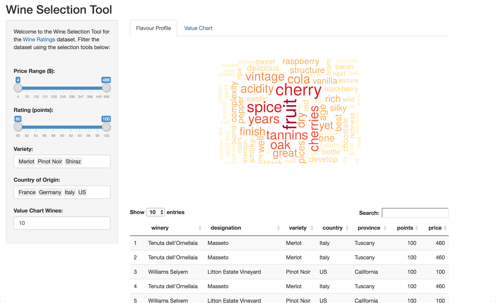

The main page with default settings.

#### Screenshot 2
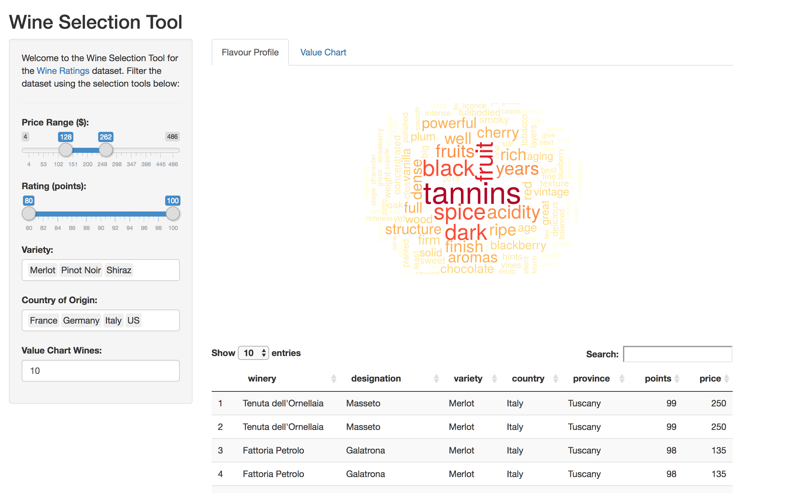

The main page with modified price range setting.

#### Screenshot 3
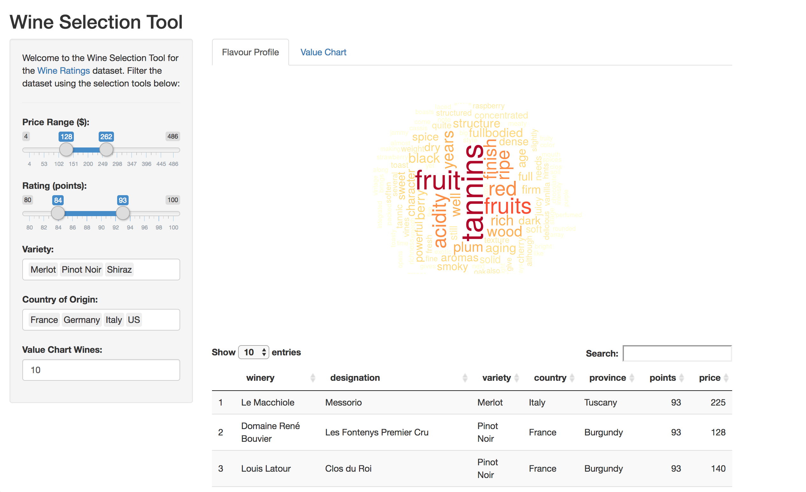

The main page with modified point range setting.

#### Screenshot 4
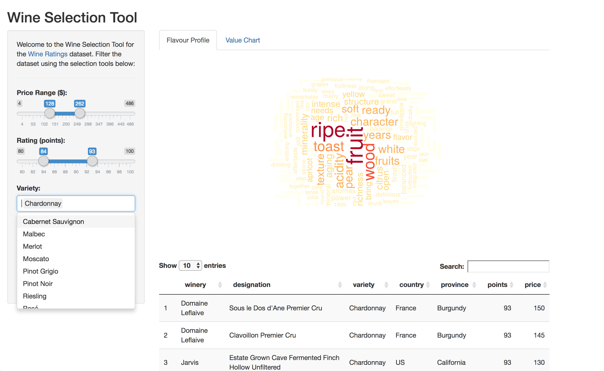

The main page with modified wine variety settings.

#### Screenshot 5
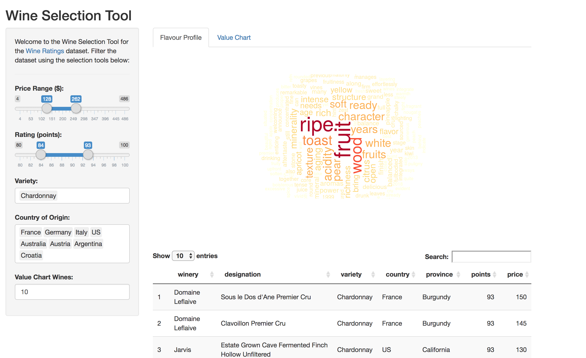

The main page with modified country settings.

#### Screenshot 6
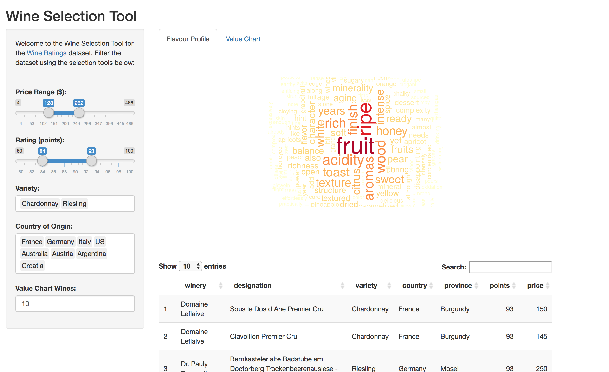

The main page with modified wine variety settings.

#### Screenshot 7
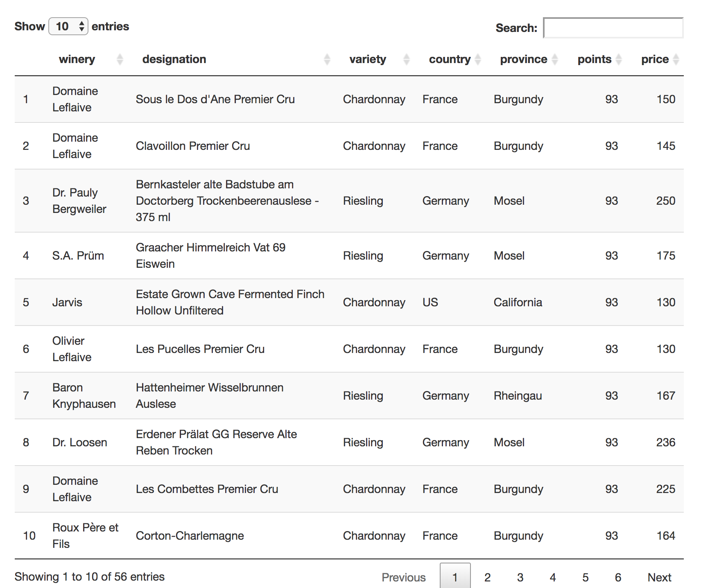

The rendered datatable with varying size.

#### Screenshot 8
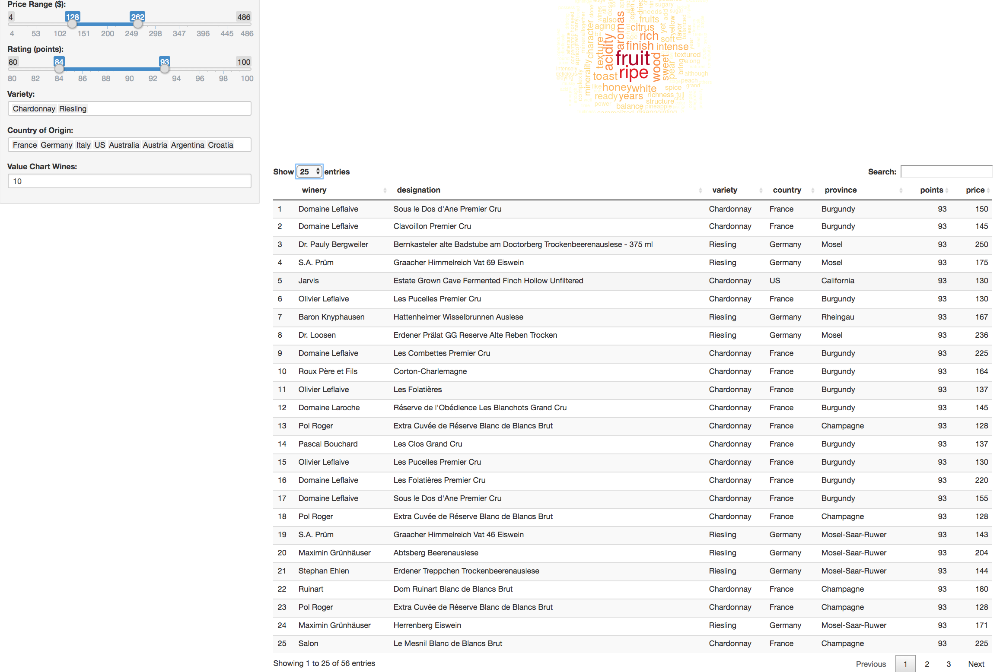

The complete main page with rendered data table.

#### Screenshot 9
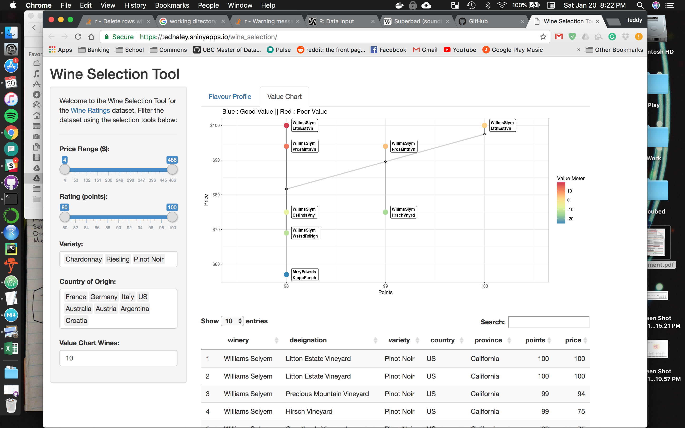

The second page with value chart and rendered data table (default settings).

#### Screenshot 10
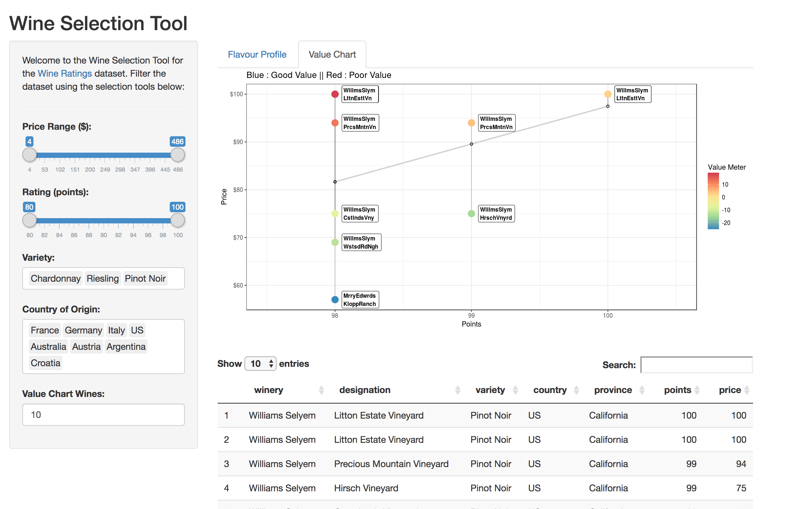

The value chart with modified price range.

#### Screenshot 11
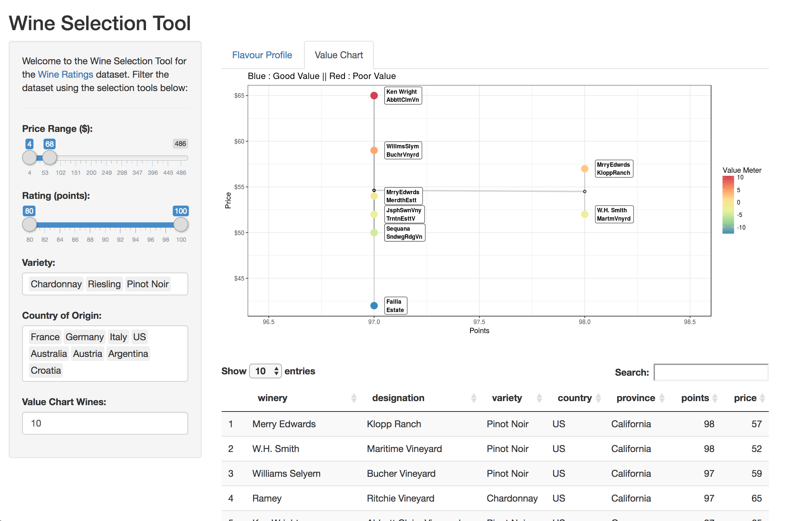

The value chart with modified point range.

#### Screenshot 12
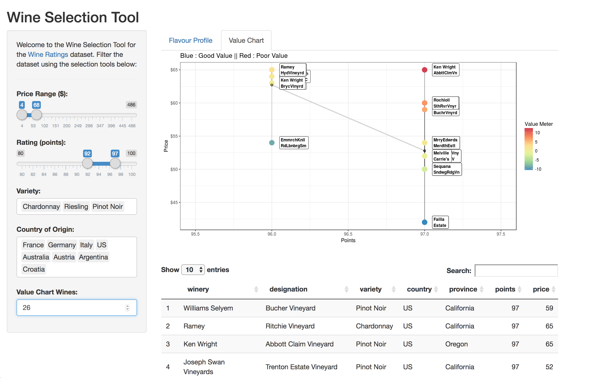

The value chart with additional entries to compare.